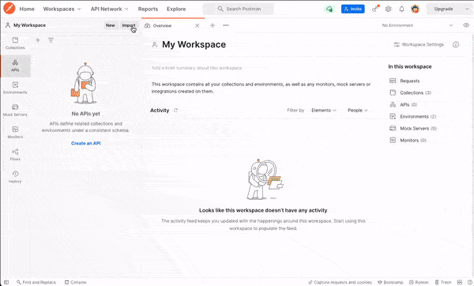

# Banking Backend - BaaS

This is the backend for the `Wallet Digital` module inside the app.

## Requirements

Make sure you have all this installed:

- `Docker`
- `node`
- `yarn`
- `.env.development` and `.env.test` inside the `src/config` folder.
- Simple copy the file `docker-compose.example.yml` renaming it to `docker-compose.yml`.

## Stack

This project uses the following stack:

- Node 16.x.x
- PostgreSQL
- Typescript
- Express
- TypeORM
- Node-Cache
- EsLint
- Jest
- AdminJS (aka Admin Bro)
- Open API (aka Swagger UI)
- RabbitMQ
- Pino (logger)

## How to run with Docker

To build and run the project just run the following command:

```sh
$ docker-compose up --build
```

## How to run with yarn

To run the project follow these steps:

```sh
$ yarn install
$ docker-compose up db db_test -d # running the databases
$ yarn nodemon
```

Running tests using yarn:

```sh
$ yarn test
```

**Obs.**: Make sure that the `DATABASE_URL` is configured to the correct host. Docker uses the service name (i.e. `db`) to find the database service. When running with `yarn` is necessary to modify it to `localhost` or add the service name to `/etc/hosts` using `127.0.0.1` as the address.

## Database

The database used in this project is PostgresSQL. There are necessary two databases instances running for the project development. One for migrations and storing data and the other to run the tests. The default ports are `5432` to the system database and `5433` to the tests database. Also, there's a shell script to avoid running the express server before the database goes up.

## OpenAPI Specification

The API's documentation can be found accessing the route `http://localhost:9000/docs`.

- ### How to import OpenAPI into Postman? **(only Postman version 6.6+)**
  
  <br/>\* Route link used on the GIF above: `http://localhost:9000/docs/openapi.json`
