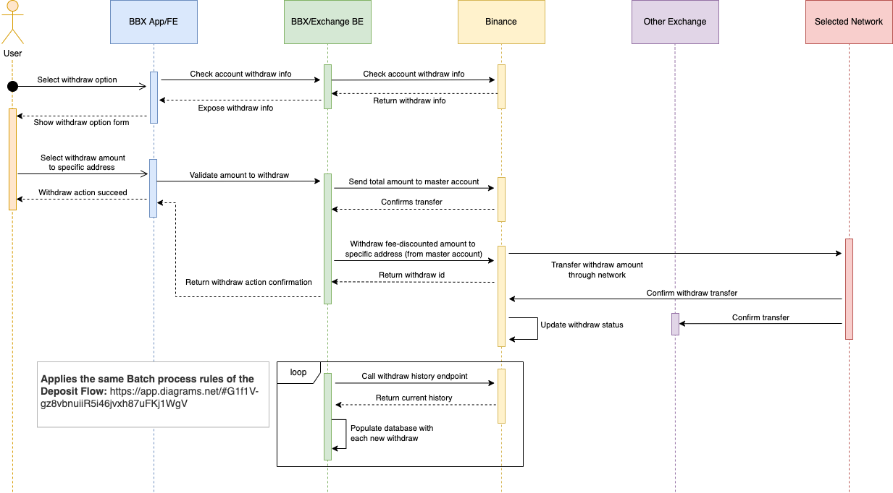

# Exchange: Enviar (saque)

**Versão:** 5

**Última atualização em:** 12/05/2022

---

```toc
style: number
max_depth: 6
allow_inconsistent_headings: false
varied_style: false
```

---

## Fluxo base para saque (função "enviar")

Durante o processo de validação da funcionalidade pela equipe de Engenharia, foi desenhado o fluxo que seria utilizado para a implementação da funcionalidade.

Assim, foi gerado um diagrama de sequência que compõe a imagem disposta abaixo, na subseção [diagrama](#diagrama).

O fluxo em si pode ser também descrito da seguinte maneira:

1. O usuário seleciona a opção de enviar valores para outra carteira
2. O app verifica com o backend os detalhes da conta/rede para saque (como informações para validação do endereço e do MEMO)
3. O backend consulta a Binance para obter tais detalhes para o usuário em questão
4. A Binance retorna os dados para o backend
5. O backend retorna os dados para o app
6. O app exibe para o usuário o formulário para que sejam informados o valor do ativo a ser enviado e o endereço
7. O usuário preenche o formulário informando a quantia a ser enviada e os dados para envio (como endereço e MEMO)
8. O app valida os dados informados com base nas informações de validação obtidas no passo 2 e no saldo atual do usuário para o referido ativo
9. O backend envia para a Binance a requisição para iniciar a transação de envio do valor para o endereço informado
10. A Binance realiza o procedimento de envio do ativo para o novo endereço na rede selecionada no início do processo (por padrão, a rede _default_ do ativo)
11. Enquanto a transferência é processada na rede do ativo, a Binance retorna para o backend o ID do processo de saque (_withdraw_) salvo internamente
12. O backend, de posse da confirmação por parte da Binance (o ID) de que a transferência foi iniciada, retorna para o app a confirmação da transferência
13. O app exibe para o usuário uma mensagem de que a transferência foi iniciada e está sendo processada
14. A rede do asset, quando a transação termina de ser processada e confirmada, informa à Binance de que o processamento foi concluído
15. A Binance, uma vez informada a finalização do processamento da transferência do asset na rede, atualiza o status do seu cadastro interno referente ao processo de saque
16. A rede do asset, quando a transação termina de ser processada e confirmada, informa à exchange que vai receber o valor de que o processamento foi concluído
17. Assincronamente, o backend executa, de tempos em tempos (por exemplo, a cada 1h) uma série de requisições para a Binance para obter o histórico recente de saques nas contas dos usuários (uma requisição por usuário) - buscando apenas por usuários que tenham transações de envio ainda pendentes
18. A Binance retorna o histórico do usuário solicitado a cada requisição
19. O backend processa o retorno de cada um dos históricos e registra no banco de dados aqueles saques que tenham ocorrido desde a última execução e/ou não tenham sido processados ainda.

É importante ter em mente que o processo de múltiplas requisições à Binance de tempos em tempos se dá devido a algumas limitações tecnológicas atualmente presentes, conforme listadas no [arquivo de documentação do fluxo de receber (depósito)](<./Exchange%3A%20Receber%20(dep%C3%B3sito).md>). Por isso, a abordagem para lidar com tais limitações é a mesma utilizada em ambos os fluxos.

### Diagrama

Abaixo consta o diagrama de sequência citado anteriormente, relacionando-se também com o diagrama para o processo de depósito, uma vez que a base para o processamento de conjuntos de dados, descrito no bloco _loop_ do diagrama, é essencialmente a mesma entre ambos os fluxos.



Link para o documento editável do diagrama: [documento Draw.io](https://app.diagrams.net/#G1sJjh9pTw5aWbas72xMkGU3vtDcopDOWM)

Link para o documento editável do diagrama relacionado (de depósito): [documento Draw.io](https://app.diagrams.net/#G1f1V-gz8vbnuiiR5i46jvxh87uFKj1WgV)

### Requisitos em endpoints

No endpoint de detalhes de um asset (`/api/v1/assets/{symbol}`), é necessário haver dois campos para indicar se o asset, por padrão, está habilitado para transferências de depósito e saque (enviar e receber):

```json
{
  ...
  "withdrawEnabled": true,
  "depositEnabled": true
}
```

Esses campos são requisitos compartilhados entre o fluxo de receber e o de enviar, portanto uma mesma alteração nesse endpoint já o torna apto a lidar com ambos os processos de transferência.

Além disso, os seguintes endpoints e seus retornos são necessários para viabilizar a consulta de redes disponíveis e para de fato iniciar uma transferência em uma determinada rede (note que os valores das propriedades descritas são apenas exemplos):

- `/api/v1/assets/{symbol}/networks` [GET] (o mesmo endpoint utilizado pelo processo de depósito)

  ```json
  [
    {
      "code": "ETH",
      "name": "Ethereum (ERC20)",
      "isDefaultNetwork": true,
      "withdrawEnabled": true,
      "depositEnabled": true,
      "supportsMemo": false,
      "addressRegex": "^(0x1)[0-9]+",
      "memoRegex": "^(0x1)[0-9]+",
      "minConfirmations": 30,
      "withdrawFee": 0.00035,
      "minimumWithdrawAmount": 0.1,
      "maximumWithdrawAmount": 999999
    }
  ]
  ```

- `/api/v1/transfers/withdraw` [POST]

  Corpo da requisição:

  ```json
  {
    "amount": 0.031,
    "symbol": "BTC",
    "networkCode": "BTC",
    "address": "0x155823096482",
    "memo": "0x1425592098",
    "pin": "1234"
  }
  ```

  Retorno (HTTP `200`):

  ```json
  {
    "amount": 0.031,
    "fees_discounted_amount": 0.020907,
    "symbol": "BTC",
    "network": {
      "name": "BTC",
      "code": "BTC",
      "transferFee": 0.01,
      "transferId": null
    },
    "exchangeTransferId": "74974112365",
    "address": "0x3516238",
    "memo": "0x918233",
    "status": "pending",
    "createdAt": "2021-12-09T21:06:08.943Z",
    "updatedAt": "2021-12-09T21:06:08.943Z"
  }
  ```

  **Possíveis status do backend**

  - **pending**: operação pendente
  - **failed**: operação concluída, porém falhada
  - **completed**: operação concluída com sucesso

  > **Possíveis status por parte da Binance** ([link para a documentação](https://www.binance.com/en/support/faq/a6f58adc6f5640f8af08aa70a55760f7)):
  >
  > - **email_sent**: somente por saques realizados pela interface da Binance
  > - **cancelled**: cancelado (a partir do estado de Awaiting Approval)
  > - **awaiting_approval**: aguardando aprovação por parte da rede/Binance (pode durar dias)
  > - **processing**: processando o saque
  > - **rejected**: rejeitado [pela própria Binance](https://dev.binance.vision/t/my-withdrawal-suspended-when-i-use-withdrawal-api/7701)
  > - **failure**: falha no saque (pode haver a necessidade de contatar a Binance)
  > - **completed**: saque realizado com sucesso
