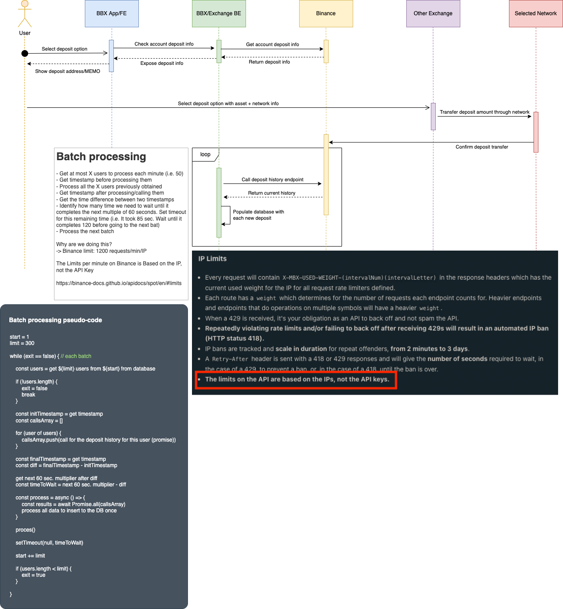

# Exchange: Receber (depósito)

**Versão:** 2

**Última atualização em:** 12/04/2022

---

```toc
style: number
max_depth: 6
allow_inconsistent_headings: false
varied_style: false
```

---

## Fluxo base para depósito (função "receber")

Durante o processo de validação da funcionalidade pela equipe de Engenharia, foi desenhado o fluxo que seria utilizado para a implementação da funcionalidade.

Assim, foi gerado um diagrama de sequência que, junto de observações sobre o processamento de dos depósitos realizados nas contas dos usuários, compõe a imagem do diagrama disposta abaixo, na subseção [diagrama](#diagrama).

O fluxo em si pode ser também descrito da seguinte maneira:

1. O usuário seleciona a opção de depositar valores a partir de outra carteira
2. O app verifica com o backend os detalhes da conta para depósito (endereço e MEMO)
3. O backend consulta a Binance para obter tais detalhes de conta para o usuário em questão
4. A Binance retorna os dados da conta para o backend
5. O backend retorna os dados da conta para o app
6. O app exibe para o usuário o endereço e o MEMO para depósito
7. O usuário acessa a outra exchange onde possui carteira e seleciona a opção de transferir para outra carteira
8. A exchange em questão inicia a transferência na rede selecionada
9. A Binance confirma a transferência para a conta do usuário a partir da rede selecionada
10. Assincronamente, o backend executa, de tempos em tempos (por exemplo, a cada 1h) uma série de requisições para a Binance para obter o histórico recente de depósitos nas contas dos usuários (uma requisição por usuário)
11. A Binance retorna o histórico do usuário solicitado a cada requisição
12. O backend processa o retorno de cada um dos históricos e registra no banco de dados aqueles depósitos que tenham ocorrido desde a última execução e/ou não tenham sido processados ainda.

É importante ter em mente que o processo de múltiplas requisições à Binance de tempos em tempos se dá devido a algumas limitações tecnológicas atualmente presentes:

- Não há um "gatilho" que possa ser configurado na Binance para que ela notifique o backend quando um novo depósito é confirmado - por isso, o backend precisa constantemente consultar o histórico
- A Binance estabelece um limite de requisições por minuto baseado no IP da máquina de origem, portanto o processamento dos dados deve levar isso em consideração ao realizar as chamadas.

Da maneira como foi pensado o fluxo de depósito, para lidar com essa segunda limitação, seria realizado um número seguro de requisições, de forma a evitar interferência em outros serviços que fazem chamadas à Binance, e após sua realização o backend ficaria em "modo de espera" até que acontecesse a virada para o próximo minuto, antes de realizar novas requisições.

### Diagrama

Abaixo consta o diagrama de sequência citado anteriormente, contendo também uma breve descrição do que foi pensado para o processamento dos dados de depósitos recentes, bem como uma _screenshot_ da documentação da Binance a respeito do limite de requisições e um pseudocódigo para descrever o algoritmo pensado para esse processo assíncrono de consulta e processamento dos depósitos.



Link para o documento editável do diagrama: [documento Draw.io](https://app.diagrams.net/#G1f1V-gz8vbnuiiR5i46jvxh87uFKj1WgV)

Link referenciado sobre os limites: [documentação da Binance](https://binance-docs.github.io/apidocs/spot/en/#limits)

### Requisitos em endpoints

No endpoint de detalhes de um asset (`/api/v1/assets/{symbol}`), é necessário haver dois campos para indicar se o asset, por padrão, está habilitado para transferências de depósito e saque (enviar e receber):

```json
{
  ...
  "withdrawEnabled": true,
  "depositEnabled": true
}
```

Além disso, os seguintes endpoints e seus retornos são necessários para viabilizar a consulta de redes disponíveis e o endereço do usuário para uma determinada rede (note que os valores das propriedades descritas são apenas exemplos):

- `/api/v1/assets/{symbol}/networks` [GET]

  ```json
  [
    {
      "code": "ETH",
      "name": "Ethereum (ERC20)",
      "isDefaultNetwork": true,
      "withdrawEnabled": true,
      "depositEnabled": true,
      "supportsMemo": false,
      "addressRegex": "^(0x1)[0-9]+",
      "memoRegex": "^(0x1)[0-9]+",
      "minConfirmations": 30,
      "withdrawFee": 0.00035,
      "minimumWithdrawAmount": 0.1,
      "maximumWithdrawAmount": 999999
    }
  ]
  ```

- `/api/v1/assets/{symbol}/networks/{network}/address` [GET]

  ```json
  {
    "address": "0x155823096482",
    "memo": "0x1425592098"
  }
  ```
